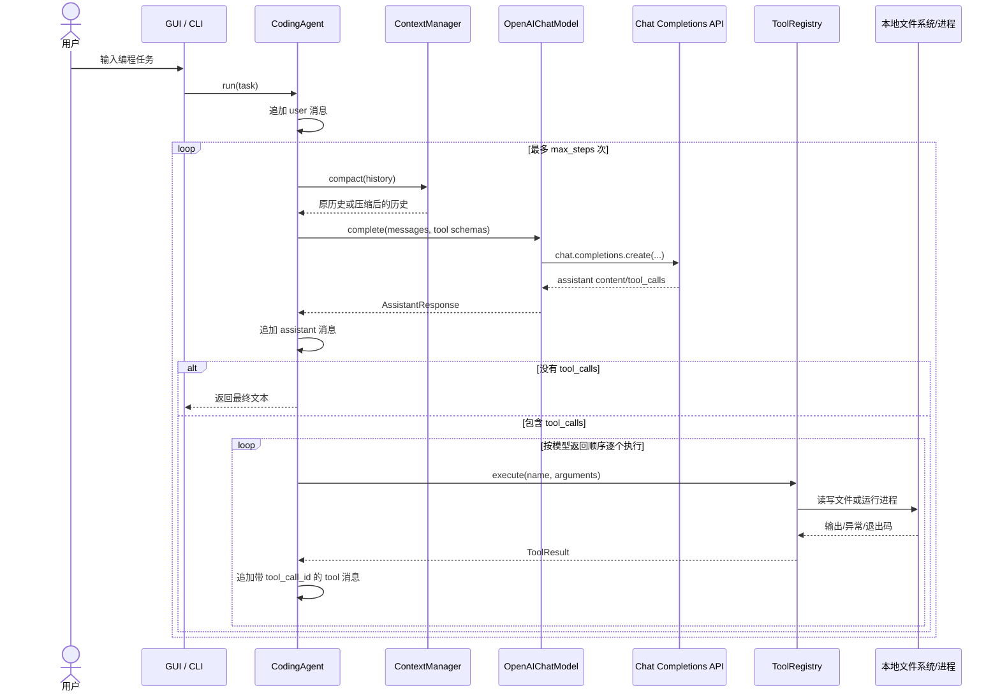
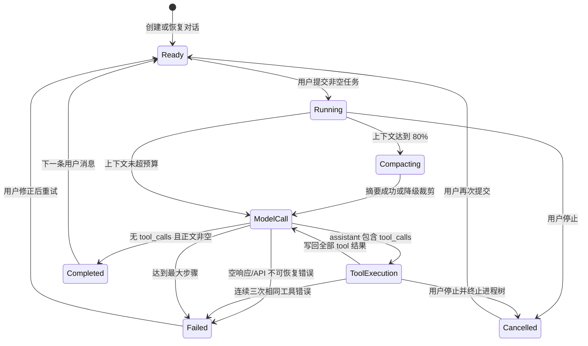

# Coding Agent 核心运行逻辑详解

本文基于当前仓库代码，说明 Coding Agent 如何自行实现以下五项核心能力：

1. 对话历史与上下文管理；
2. 工具的定义与本地执行；
3. 模型输出的解析；
4. Agent 循环及终止条件；
5. 分层错误处理。

项目只使用基础客户端库 `openai` 发送 Chat Completions 请求。Agent 编排、消息历史、工具注册、参数校验、本地执行和终止判断均由项目代码实现，没有使用 `openai-agents` 或其他 Agent 框架。

## 1. 总体架构

核心模块及职责如下：

| 模块 | 主要职责 |
| --- | --- |
| [`agent.py`](../src/coding_agent/agent.py) | 驱动“模型调用 → 工具执行 → 再次调用模型”的 Agent 循环 |
| [`context.py`](../src/coding_agent/context.py) | 估算上下文大小、按完整轮次压缩历史、截断旧工具输出 |
| [`model.py`](../src/coding_agent/model.py) | 封装基础 `OpenAI` 客户端，构造 Chat Completions 请求并解析响应 |
| [`tools.py`](../src/coding_agent/tools.py) | 定义工具 Schema、校验参数、执行文件和命令工具 |
| [`safety.py`](../src/coding_agent/safety.py) | 对本地命令进行 safe/review/deny 三级风险分类 |
| [`prompts.py`](../src/coding_agent/prompts.py) | 系统提示、无工作目录提示和上下文摘要提示 |
| [`gui.py`](../src/coding_agent/gui.py) | 管理项目、对话、后台线程、用户审批和界面事件 |
| [`session_store.py`](../src/coding_agent/session_store.py) | 将项目、对话、展示记录和协议历史保存到本地 JSON |

一次任务的主数据流为：



这里最重要的边界是：`OpenAIChatModel` 只负责网络传输和响应格式转换，真正的循环在 `CodingAgent.run()` 中，本地工具也全部由 `ToolRegistry` 执行。

## 2. 对话历史与上下文管理

### 2.1 两套记录：协议历史与界面记录

GUI 中的每个对话由 [`TaskSession`](../src/coding_agent/gui.py#L91) 表示。一个任务同时维护两类记录：

- `session.agent.history`：发送给模型的协议历史；
- `session.entries`：用于 GUI 渲染的简化展示记录。

二者不能混为一谈。

`history` 使用 Chat Completions 消息格式，包含 `system`、`user`、`assistant` 和 `tool` 角色，还会保留完整 `tool_calls` 与 `tool_call_id`。它决定模型下一步能看到什么。

`entries` 只保存 `ChatEntry(kind, text)`，用于给用户显示聊天内容、工具进度和错误。例如 GUI 收到 `tool_start` 事件时，会把工具名和参数摘要写入展示记录；真实的工具协议消息则由 Agent 写入 `history`。

这种分离有两个好处：

1. GUI 可以用更友好的格式展示工具进度，而不必直接渲染协议 JSON；
2. 模型历史可以保留严格的 assistant/tool 对应关系，不受界面文案影响。

### 2.2 历史的初始化和追加

[`CodingAgent.__init__`](../src/coding_agent/agent.py#L25) 初始化历史时只放入一条系统消息：

```python
self.history = [{"role": "system", "content": system_prompt}]
```

收到任务后，[`CodingAgent.run`](../src/coding_agent/agent.py#L48) 先检查任务不是空字符串，再追加用户消息：

```python
self.history.append({"role": "user", "content": task})
```

模型响应由 `_append_assistant()` 写入历史。如果模型调用了工具，assistant 消息不仅包含文本，还包含原始 `tool_calls`。每个本地执行结果随后以 `role="tool"` 写回，并保留模型给出的 `tool_call_id`：

```python
{
    "role": "tool",
    "tool_call_id": call.id,
    "content": result.to_message(),
}
```

这是原生 tool calling 协议的关键：下一次请求中，API 能用 `tool_call_id` 判断某条工具结果对应哪一次调用。

`clear()` 不会删除 Agent 对象，而是把历史恢复为唯一的系统消息，从而开始一个新的模型上下文。

### 2.3 有工作目录与无工作目录对话

GUI 创建新对话时，初始 `project_id=None`，并用 `workspace=None` 创建工具注册表。此时：

- 使用 [`PROJECTLESS_SYSTEM_PROMPT`](../src/coding_agent/prompts.py)，明确告诉模型当前不能声称已经访问本地文件；
- `ToolRegistry.schemas()` 返回空列表，模型请求中不会出现本地工具；
- 如果程序仍尝试执行工具，注册表会返回“当前对话尚未选择工作目录”。

用户给当前对话选择目录后，[`_retarget_agent()`](../src/coding_agent/gui.py#L778) 会重新创建 Agent 和工具注册表，并替换系统提示，但保留旧历史中从第二条开始的消息：

```python
session.agent.history = [session.agent.history[0], *history[1:]]
```

因此，同一段对话可以从一般问答切换到项目操作，同时不会继续携带旧的“无工作目录”系统提示。

### 2.4 token 预算估算

[`ContextManager.estimate_tokens()`](../src/coding_agent/context.py#L23) 没有依赖特定模型 tokenizer，而是先把消息序列化成紧凑 JSON，再取以下两种估算中的较大值：

```text
ceil(UTF-8 字节数 / 4)
ceil(字符数 / 2)
```

第二项是对中文等 CJK 文本的保守下限，避免只用“字符数除以 4”严重低估中文上下文。

默认在估算值达到 `max_tokens × 0.8` 时触发压缩，给下一次模型输出和协议开销保留余量。预算来自 `CODING_AGENT_CONTEXT_TOKENS` 或本地设置。

### 2.5 按完整用户轮次压缩

[`ContextManager.compact()`](../src/coding_agent/context.py#L29) 的压缩流程是：

1. 复制当前消息，避免直接修改调用者传入的对象；
2. 未达到 80% 阈值时原样返回；
3. `_partition_turns()` 以每条 `user` 消息作为新轮次起点；
4. 每个 user 后面的 assistant、tool、后续 assistant 都归入同一轮；
5. 默认保留最近两个完整轮次；
6. 将更早的完整轮次序列化后交给 `_summarize()`；
7. 用一条 `system` 摘要替代旧轮次；
8. 如果仍然超预算，再截断过长的旧工具输出。

按 user 消息分组的意义是：一个 assistant 的工具调用和对应 tool 结果不会被拆成两半。否则保留了 tool 结果却删掉 assistant 的 `tool_calls`，会产生无效的 Chat Completions 消息序列。

### 2.6 摘要请求和降级策略

摘要由 [`CodingAgent._summarize()`](../src/coding_agent/agent.py#L113) 发起。它是一次单独的、**不提供工具 Schema** 的模型请求：

```python
self.model.complete(summary_messages, None)
```

摘要提示要求保留目标、决策、修改文件、测试结果、未完成事项和关键错误。如果摘要响应调用了工具或没有正文，则视为无效并抛出 `ModelError`。

`ContextManager.compact()` 会捕获摘要阶段的所有异常。如果摘要失败，它不会让整个 Agent 崩溃，而是删除旧轮次并插入保守说明：

> 较早会话因上下文预算已被裁剪；请依据当前工作区和近期消息继续。

最后 `_truncate_large_results()` 会把超过 4,000 字符的旧 `tool` 内容截断，并添加明确标记。

需要注意，当前算法是轻量级近似方案：它不使用模型专用 tokenizer，也不保证一次压缩后绝对低于预算。如果最近两个轮次本身非常大，代码只会进一步截断工具结果，不会截断超长 user 或 assistant 文本。这是当前实现的一个明确边界。

### 2.7 本地会话持久化

[`SessionStore`](../src/coding_agent/session_store.py#L72) 把状态保存在：

```text
.coding-agent/sessions.json
```

保存内容包括：

- `projects`：项目 ID、显示名称和目录；
- `tasks`：对话 ID、所属项目、标题、GUI `entries` 和模型 `history`；
- `current_id`：当前选中的对话；
- `version`：当前格式版本为 2。

写入时先生成 `sessions.tmp`，再用 `replace()` 替换正式文件，降低程序中断造成半写文件的概率。加载时遇到文件不存在、JSON 损坏或结构无效，会返回空状态而不是使 GUI 无法启动。代码还包含从嵌套项目任务结构的版本 1 到扁平任务结构版本 2 的迁移逻辑。

该文件已被 Git 忽略，但它是普通本地 JSON，并未加密，因此不应在对话中主动读取或保存密钥等敏感内容。

## 3. 工具的定义与本地执行

### 3.1 工具抽象

[`LocalTool`](../src/coding_agent/tools.py#L58) 是项目自己的工具描述结构，包含：

- `name`：模型调用时使用的工具名；
- `description`：告诉模型工具用途；
- `parameters`：JSON Schema 参数定义；
- `handler`：实际在本机执行的 Python 函数。

`LocalTool.schema()` 将其转换成 Chat Completions 原生 function tool 格式：

```json
{
  "type": "function",
  "function": {
    "name": "read_file",
    "description": "读取 UTF-8 文本文件，可指定起始行和最大行数。",
    "parameters": { "type": "object", "properties": {} }
  }
}
```

[`ToolRegistry`](../src/coding_agent/tools.py#L75) 负责注册工具、输出全部 Schema、校验参数并分派到 handler。这里没有使用任何 Agent SDK 的 Tool 抽象。

### 3.2 参数校验

`ToolRegistry.execute()` 的处理顺序为：

1. 检查当前对话是否绑定工作目录；
2. 检查工具名是否存在；
3. 用 `_validate()` 校验参数；
4. 调用对应 handler；
5. 将可预期异常转换为失败的 `ToolResult`。

自建校验器支持当前工具需要的 JSON Schema 子集：

- 必需字段 `required`；
- 禁止额外字段 `additionalProperties: false`；
- `string`、`integer`、`boolean` 类型；
- 整数 `minimum` 和 `maximum`；
- 特别排除 Python 中 `bool` 被当成 `int` 的情况。

校验错误不会抛到主循环外，而会成为结构化工具失败消息返回给模型，模型下一轮可以修正参数。

### 3.3 六个本地工具

| 工具 | 本地实现逻辑 | 主要限制 |
| --- | --- | --- |
| `list_files` | 使用 `Path.rglob()` 遍历并排序，过滤 `.git`，支持 glob 和数量上限 | 默认最多 200，Schema 最大 500 |
| `read_file` | 以 UTF-8 读取，按起始行和最大行数切片，并附加行号 | 默认 400 行，最大 2,000 行，输出统一截断 |
| `search_text` | 优先调用本机 `rg`；没有 `rg` 时用 Python 遍历 UTF-8 文本 | 跳过不可解码文件，限制匹配数量 |
| `write_file` | 创建父目录并完整写入 UTF-8 文本 | 单次内容不超过 200,000 字符 |
| `replace_text` | 统计旧文本出现次数后执行精确替换 | 默认要求唯一匹配，多次匹配须显式 `replace_all` |
| `run_command` | 在工作区启动 PowerShell 或 `/bin/sh` 子进程，收集退出码和输出 | 1–300 秒超时、风险审批、取消和输出截断 |

所有结果都使用 [`ToolResult`](../src/coding_agent/tools.py#L24)：

```python
ToolResult(ok: bool, output: str = "", error: str | None = None)
```

`to_message()` 把结果序列化为 JSON，例如：

```json
{"ok": false, "error": "路径不存在: missing.py"}
```

模型得到的是明确的数据状态，而不是依赖解析终端颜色或 Python traceback。

### 3.4 路径边界

[`PathGuard.resolve()`](../src/coding_agent/tools.py#L42) 对每个文件路径执行以下处理：

1. 相对路径拼接到工作区；
2. 调用 `resolve(strict=False)` 规范化路径并解析已有符号链接；
3. 用 `resolved.relative_to(workspace)` 验证最终路径仍在工作区；
4. 对要求已存在的路径检查 `exists()`。

因此以下情况都会被拒绝：

- `../outside.txt` 路径穿越；
- 指向工作区外的绝对路径；
- 工作区内的符号链接指向外部文件。

这是文件工具的应用层边界。它不是操作系统沙箱，但能阻止模型通过正常工具参数直接逃逸工作区。

### 3.5 命令安全分级

[`CommandPolicy.classify()`](../src/coding_agent/safety.py#L62) 把命令分为三级：

- `SAFE`：已识别的只读、测试或构建命令，如 `git status`、`rg`、`python -m pytest`；
- `REVIEW`：安装依赖、联网、删除、Git 修改、访问 `..` 或未知命令，需要用户确认；
- `DENY`：破坏 Git 历史、系统控制、提权、根目录删除或工作区外删除，直接拒绝。

`run_command` 先分类，再根据 `approval_mode` 决定是否弹出审批：

- `ask`：只对 `REVIEW` 命令询问；
- `always`：所有非拒绝命令都询问；
- `DENY`：不询问，直接返回失败。

GUI 的审批跨线程实现位于 `_request_approval()`：后台 Agent 线程把审批事件放入队列，GUI 主线程显示确认框，再通过 `threading.Event` 把结果返回后台线程。这样避免后台线程直接操作 Tkinter 控件。

### 3.6 命令执行、超时和取消

Windows 下命令通过非交互 PowerShell 执行；POSIX 下使用 `/bin/sh -lc`。子进程的 `cwd` 被固定为工作区，stdout/stderr 使用 UTF-8 并以替换方式处理不可解码字符。

程序每最多 0.2 秒轮询一次进程：

- 正常结束：返回真实 `exit_code` 与合并后的 stdout/stderr；
- 非零退出：`ok=false`，但仍保留退出码和输出供模型诊断；
- 达到超时：终止整个进程组/进程树；
- 用户取消：同样终止进程树，并返回“命令已由用户停止”；
- 输出超过默认 16,000 字符：截断并注明省略字符数。

Windows 使用 `taskkill /F /T` 尝试结束整个进程树，POSIX 使用新的 session 和 `killpg()`，避免只杀掉 shell 而留下测试或构建子进程。

## 4. 模型输出的解析

### 4.1 模型适配层的边界

[`OpenAIChatModel`](../src/coding_agent/model.py#L53) 是一个很薄的适配器。构造函数只创建基础客户端：

```python
self._client = OpenAI(
    api_key=api_key,
    base_url=base_url,
    timeout=timeout,
    max_retries=0,
)
```

项目把 SDK 自带重试设为 0，是因为有限重试由本项目自己实现。这里没有 `Agent`、`Runner`、`Session` 或服务端文件工具。

### 4.2 请求构造

`complete()` 始终发送：

```python
{
    "model": self.model,
    "messages": list(messages),
}
```

只有工具列表非空时才增加：

```python
{
    "tools": list(tools),
    "tool_choice": "auto",
}
```

因此，上下文摘要和无工作目录对话可以真正做到“不向模型提供工具”，而不是仅靠提示词要求模型别使用工具。

### 4.3 响应转换

适配器只读取第一个 `choice`。如果 `choices` 为空，则抛出 `ModelError`。普通文本、finish reason 和 function tool calls 被转换为项目自己的不可变数据结构：

```python
AssistantResponse(
    content=message.content,
    tool_calls=(ToolCall(...), ...),
    finish_reason=choice.finish_reason,
)
```

每个 [`ToolCall`](../src/coding_agent/model.py#L21) 保存：

- `id`：API 分配的调用 ID；
- `name`：函数名；
- `arguments`：模型生成的原始 JSON 字符串。

只解析 `type == "function"` 的调用，其他类型不会进入本地工具循环。

### 4.4 参数解析与结果回传

模型层故意不解析 `arguments`，因为“响应格式转换”和“工具调用有效性”属于不同职责。Agent 的 `_execute_call()` 使用 `json.loads()` 解析：

- JSON 语法错误 → `ToolResult(False, "工具参数不是合法 JSON")`；
- JSON 顶层不是对象 → `ToolResult(False, "工具参数必须是 JSON 对象")`；
- 合法对象 → 交给 `ToolRegistry.execute()` 做 Schema 校验和本地执行。

不合法参数不会终止任务，而是作为对应 `tool_call_id` 的失败 tool 消息回传。模型可以在下一步读到错误并改正调用。

一个 assistant 响应可以包含多个 tool calls。`CodingAgent.run()` 按返回顺序串行执行，而不是并行执行。这保证例如“先写文件，再替换文件内容”的结果是确定的。

### 4.5 `finish_reason` 的当前作用

`finish_reason` 会被模型适配层保存到 `AssistantResponse`，但当前 Agent 循环没有根据它分支。实际终止依据是“是否存在 `tool_calls`”以及最终文本是否为空。

这意味着代码能兼容常见 `stop` 和 tool calling 流程，但没有针对 `length`、内容过滤等 finish reason 提供单独用户提示。这可以作为后续增强点。

## 5. Agent 循环与终止条件

[`CodingAgent.run()`](../src/coding_agent/agent.py#L48) 是系统的核心状态机。伪代码如下：

```text
校验任务并追加 user 消息
初始化 repeated_errors = 0

for step in 1..max_steps:
    检查用户取消
    压缩上下文
    调用模型
    检查用户取消
    追加 assistant 消息

    if 没有工具调用:
        if 最终文本为空: 异常终止
        return 最终文本

    for 每个工具调用（串行）:
        检查用户取消
        解析 JSON 并执行工具
        追加带 tool_call_id 的 tool 消息
        检查用户取消
        更新重复错误计数

达到 max_steps 后异常终止
```

### 5.1 正常终止

模型返回一个没有 `tool_calls` 的 assistant 响应，且 `content.strip()` 非空。Agent 触发 `final` 事件并把正文返回前端。

### 5.2 最大步骤终止

循环最多运行 `max_steps` 次，默认值为 20。每一次“调用模型并处理其全部工具调用”算一个 step。若最后一个 step 仍要求工具，循环结束后抛出：

```text
达到最大步骤数 N，任务未正常结束
```

它防止模型无限重复调用工具。

### 5.3 连续三次相同工具错误

Agent 为失败结果生成指纹：

```python
fingerprint = f"{call.name}:{result.error}"
```

只有工具名和错误文本都相同时才累计。任何成功工具调用都会把计数重置为 0；不同错误则从 1 重新开始。达到 3 次时抛出 `AgentStopped`。

该机制阻止模型反复执行完全相同的无效操作，同时允许它尝试其他修复方案。需要注意，指纹不包含参数：只要工具名与错误文本相同，即使参数不同也可能被视为相同错误。

### 5.4 用户取消

GUI 为每个任务维护独立的 `threading.Event`。点击停止后设置事件。Agent 会在以下边界检查取消：

- 每次调用模型前；
- 模型返回后；
- 每个工具调用前后；
- 命令运行期间约每 0.2 秒。

检测到取消后抛出 `AgentCancelled`。它继承 `AgentStopped`，但 GUI 会单独捕获并把状态显示为“已停止”，而不是普通错误。

进行中的 HTTP 请求不能被这个 Event 立即中断，只能等待请求成功或达到客户端 timeout；这是当前取消机制的边界。

### 5.5 其他立即终止条件

| 条件 | 行为 |
| --- | --- |
| 用户任务为空 | `ValueError("任务不能为空")` |
| 模型无工具调用且正文为空 | `AgentStopped("模型既未返回文本，也未调用工具")` |
| 连续三次相同工具错误 | `AgentStopped` |
| 达到最大步骤 | `AgentStopped` |
| 用户停止 | `AgentCancelled` |
| 认证错误、请求参数错误 | `ModelError`，不重试 |
| 连接、限流、超时在重试后仍失败 | `ModelError` |
| 摘要失败 | 不终止主任务，改用裁剪降级 |

## 6. 分层错误处理

错误处理不是集中在一个大范围 `try/except` 中，而是分散在最了解错误语义的层次。

### 6.1 模型层

`OpenAIChatModel.complete()` 把错误分为：

- `AuthenticationError`、`BadRequestError`：通常重试也不会成功，立即包装为 `ModelError`；
- `RateLimitError`、`APIConnectionError`、`APITimeoutError`：最多重试 `max_retries` 次；
- 其他异常：统一包装为用户可见的 `ModelError`。

重试等待采用 `2**attempt`，默认两次重试时等待 1 秒、2 秒。客户端自身的重试被关闭，所以总次数和退避逻辑完全由项目控制。

### 6.2 工具层

工具参数错误、未知工具、文件不存在、编码错误、审批拒绝、命令非零退出和超时都转换为 `ToolResult`，通常不直接抛出主循环。

这种设计很重要：工具失败是 Agent 的可观察信息，不一定意味着任务失败。例如测试命令返回非零后，模型应该读取测试输出并继续修改代码。

`ToolRegistry.execute()` 对 `OSError`、`UnicodeError`、`ValueError` 返回原始可读错误；未预料异常则带上异常类型，形成“工具执行异常”结果。

### 6.3 Agent 层

Agent 负责处理跨调用的控制性错误：

- 无效 JSON 变成工具失败消息；
- 重复失败计数决定是否停止；
- 空最终响应、最大步骤和用户取消使用明确异常类型；
- 摘要错误被上下文层降级吸收。

这使工具的一次失败与整个任务必须停止之间有清晰区别。

### 6.4 GUI 线程层

[`CodingAgentApp._run_task()`](../src/coding_agent/gui.py#L892) 在 daemon 后台线程中运行 Agent，避免模型请求或命令执行冻结 Tkinter 主线程。它把结果转换为队列事件：

- `complete`：正常答案；
- `cancelled`：用户停止；
- `error`：可预期 Agent/模型/输入错误；
- 未预期异常：包含异常类型的错误文本。

GUI 主线程每 80 毫秒轮询事件队列，并负责更新控件、对话记录和本地会话。审批也通过队列与 Event 往返，符合 Tkinter 控件只能由主线程安全操作的要求。

本地会话保存失败不会关闭应用，只把状态栏更新为“本地会话保存失败”。关闭窗口时，如果仍有任务运行，会先询问用户；确认后设置所有取消事件、保存会话，再销毁窗口。

## 7. 关键状态转换



## 8. 测试如何验证这些逻辑

项目使用自建 `ScriptedModel` 和临时目录测试，不访问真实 API。

| 测试文件 | 覆盖内容 |
| --- | --- |
| [`test_agent.py`](../tests/test_agent.py) | 普通回答、单/多工具顺序、非法 JSON、未知工具、三次错误、成功后重置错误计数、最大步骤、清空历史、取消 |
| [`test_context.py`](../tests/test_context.py) | 未超预算不修改、完整轮次摘要、assistant/tool 不拆分、摘要失败降级、大工具结果截断 |
| [`test_model.py`](../tests/test_model.py) | function tool call 解析、摘要请求不发送工具、连接错误重试、空 choices |
| [`test_tools.py`](../tests/test_tools.py) | 六类工具核心行为、路径穿越、外部符号链接、`rg` 回退、参数校验、非零退出、审批、超时和取消 |
| [`test_safety.py`](../tests/test_safety.py) | safe/review/deny 命令分类 |
| [`test_session_store.py`](../tests/test_session_store.py) | 会话保存加载、无效 JSON、版本迁移、敏感字段边界 |
| [`test_gui_sessions.py`](../tests/test_gui_sessions.py) | 无项目对话、目录绑定后保留历史、移除项目后保留对话、会话恢复和 GUI 事件行为 |

这些测试说明项目并不是只验证“最终能回答”，而是分别验证 Agent 循环中各层的协议不变量和故障路径。

## 9. 实现特点与当前边界

### 9.1 实现特点

1. **编排逻辑完全自建**：模型客户端没有承担循环、状态或工具调度职责。
2. **工具协议闭环完整**：assistant `tool_calls`、本地执行、对应 `tool_call_id` 的 tool 消息构成完整往返。
3. **错误优先反馈模型**：多数工具错误是可恢复观察值，而不是进程崩溃原因。
4. **上下文按完整轮次处理**：避免拆散 tool calling 消息组。
5. **本地执行边界清楚**：文件路径守卫、命令风险分级、用户审批和进程终止互相补充。
6. **界面与 Agent 解耦**：后台线程只产生事件，GUI 主线程负责显示和审批。

### 9.2 当前边界和可改进点

1. token 估算是模型无关近似值，不等于服务端精确计数；
2. 最近轮次中超长的 user/assistant 文本可能使压缩后仍超预算；
3. `finish_reason` 已解析但没有针对 `length` 等情况单独处理；
4. 同类工具错误指纹不包含参数，可能把不同参数导致的同文案错误合并计数；
5. 用户取消不能立即中断已经发出的 HTTP 请求；
6. `CommandPolicy` 是基于正则的应用层防护，不是容器或操作系统级沙箱；
7. 会话 JSON 未加密，只适合保存普通对话和状态，不应保存凭据；
8. 多工具调用按顺序执行，保证确定性，但没有并行优化。

这些边界并不影响第一版项目对题目核心要求的覆盖，但在答辩中主动说明它们，能够体现对系统可靠性和安全边界的理解。

## 10. 总结

该 Coding Agent 的核心不是“调用一次大模型”，而是由本地 Python 代码维护一个可控状态机：

```text
历史管理
  → 模型请求
  → 输出解析
  → 本地工具执行
  → 结构化结果回传
  → 终止或继续
```

`agent.py` 决定循环如何推进，`context.py` 决定模型能看到哪些历史，`model.py` 负责与 Chat Completions API 交换数据，`tools.py` 和 `safety.py` 决定本地能力如何安全执行，GUI 与 `session_store.py` 则提供多对话交互和进程间持久化。各层通过简单、自有的数据结构连接，正是项目“不依赖 Agent 框架，但自行实现关键逻辑”的主要体现。
